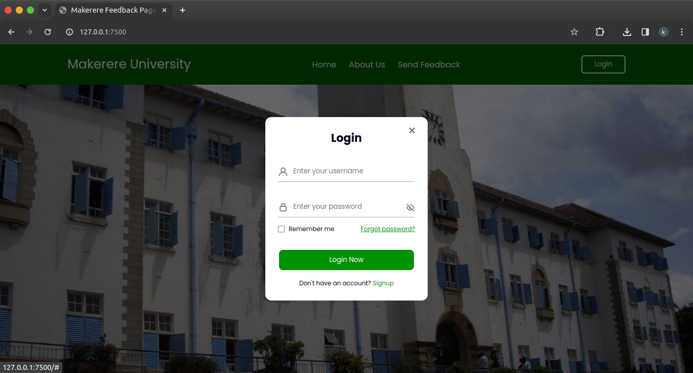
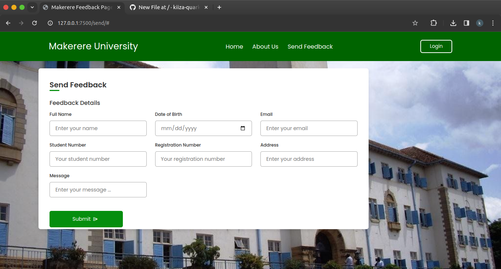
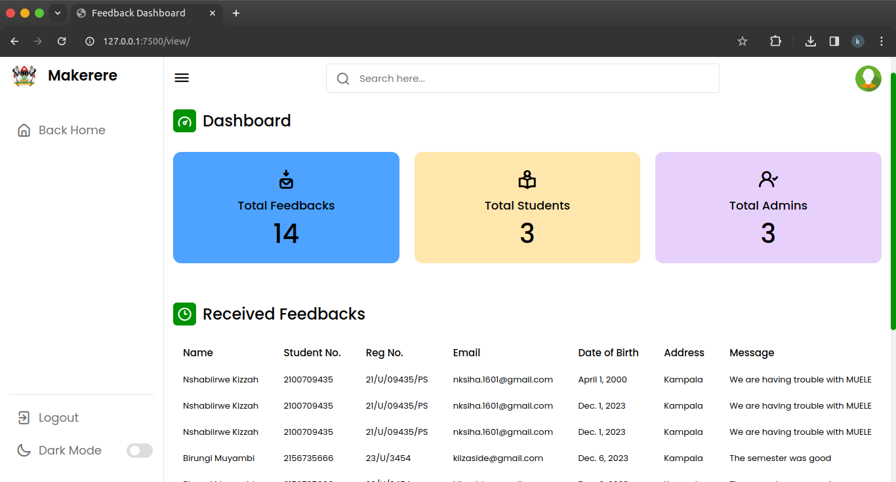
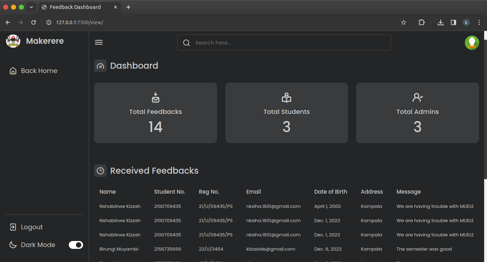

# Simple Makerere University Feedback App

[](LICENSE)

## Overview

The Makerere University Feedback App is a simple web application built using Django, designed to facilitate student feedback submission and administration. It allows students to submit their feedback, and administrators can view and manage the feedback entries.

## Features

- **User Authentication**: Secure login system for students and administrators.
- **Feedback Submission**: Students can submit their feedback through a user-friendly interface.
- **Admin Dashboard**: Administrators can easily view and manage all submitted feedback.

## Screenshots

### 1. Login Page


### 2. Send Feedback Page


### 3. Admin View Feedbacks Page




## Installation

1. Clone the repository:

   ```bash
   git clone https://github.com/your-username/makerere-feedback-app.git
   ```

2. Install dependencies:

   ```bash
   pip install -r requirements.txt
   ```

3. Run migrations:

   ```bash
   python manage.py migrate
   ```

4. Start the development server:

   ```bash
   python manage.py runserver
   ```

   Visit http://localhost:8000/ in your browser.

## License

This project is licensed under the MIT License 
